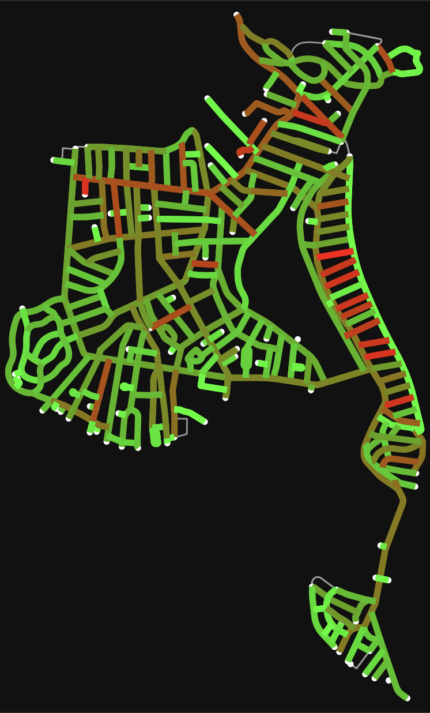

 
The general goal of this project is to see which streets have more crime in Winthrop, MA, as reported by the town police blotter. This turned out to be a greater challenge than I was expecting, due to the fact that the police blotter was written by hand and had very little consistency between each post. This means that the web scraping algorithm needs to be quite general, and the urls are in no particular order. To overcome the latter, I checked every URL of the newspaper since 2009, tracking which ones met the requirements to be a plice blotter. (see `urls.csv`). Then, I extracted all of the events from all of the posts using BeautifulSoup and general web scraping practices. (see `events.csv`)   

The plan for the future is to use an LLM and prompt engineering to depict the types and locations of specific reported incidents more accurately and have greater redundancy for issues such as misspellings. I am also hoping to add visual elements like heat maps and graphs to be able to present my data to my community.

Order of programs:
* `GetUrlsAndEvents.py` - Find all the URLs of the police blotter posts, then scrape put all the events into CSV files.
* `main.py` - Get all events and map them on top of a road map.
